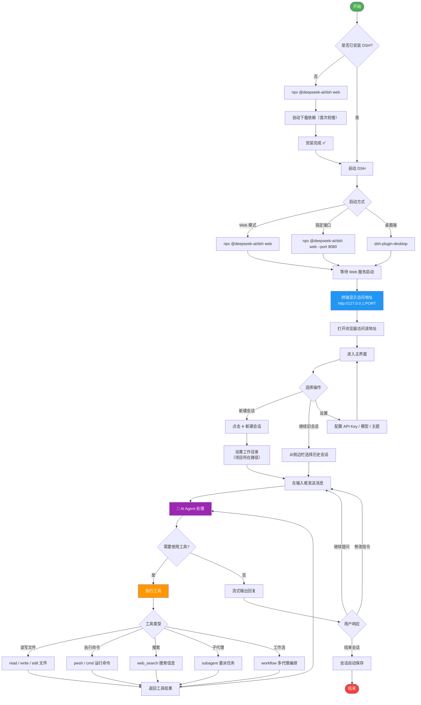

# DSH (DeepSeek Harness) 完整使用流程

## 流程图



## 命令行启动方式

### 方式 1：默认启动（推荐）
```cmd
npx @deepseek-ai/dsh web
```
启动后终端会显示访问地址，如 `http://127.0.0.1:3080`

### 方式 2：指定端口
```cmd
npx @deepseek-ai/dsh web --port 8080
```

### 方式 3：先切到项目目录再启动（推荐）
```cmd
cd D:\Administrator\Desktop\echopype
npx @deepseek-ai/dsh web
```

### 方式 4：查看帮助
```cmd
npx @deepseek-ai/dsh --help
npx @deepseek-ai/dsh web --help
```

## 三种启动模式对比

| 模式 | 命令 | 说明 |
|------|------|------|
| **Web 模式** | `npx @deepseek-ai/dsh web` | 纯浏览器访问，不需要 Electron |
| **桌面模式** | `dsh-plugin-desktop` | Electron 桌面应用，内嵌 Web 界面 |
| **Headless 模式** | `npx @deepseek-ai/dsh --profile headless "任务描述"` | 无界面，执行一次任务后退出 |

## 常用交互模式

| 模式 | 说明 | 触发方式 |
|------|------|----------|
| 普通对话 | 直接和 AI 对话 | 输入文字发送 |
| 技能 (Skill) | 加载特定技能指令 | AI 自动识别或手动触发 |
| 目标 (Goal) | 长期任务追踪 | AI 自动创建 |
| 工作流 (Workflow) | 多代理并行任务 | 用户明确要求 |
| 子代理 (Subagent) | 后台委派任务 | AI 自动委派 |

## 注意事项

1. **首次启动较慢**：`npx` 需要下载依赖包，后续启动会快很多
2. **工作目录**：DSH 的文件操作都在工作目录内进行，启动前 `cd` 到项目目录
3. **会话日志**：每次对话自动保存，异常关闭可能导致日志损坏
4. **权限策略**：默认 ask（需确认），可改为 never（自动批准）或 danger-full-access
5. **Shell 环境**：默认使用 PowerShell，支持 cmd 回退
